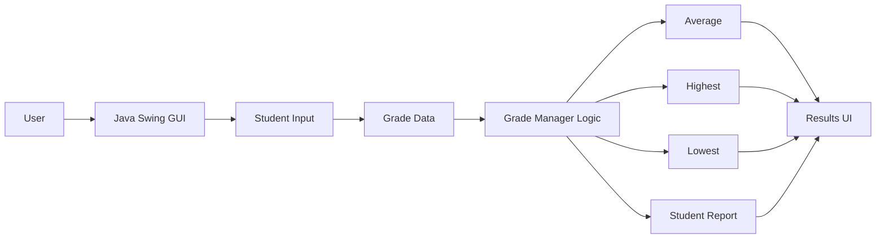
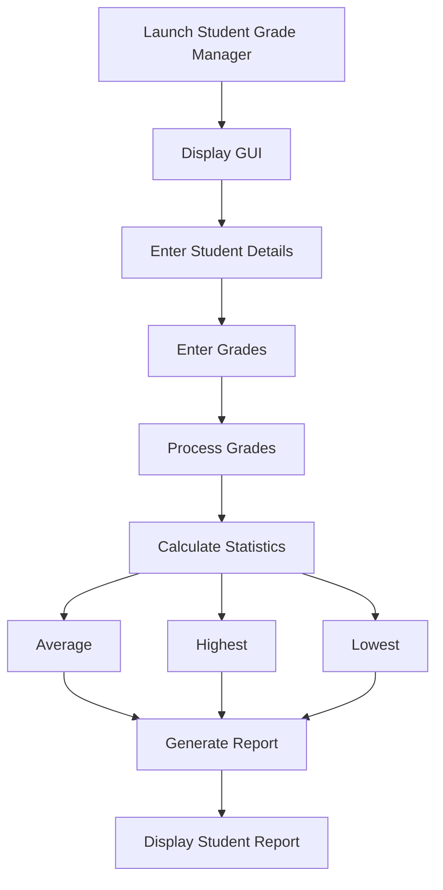
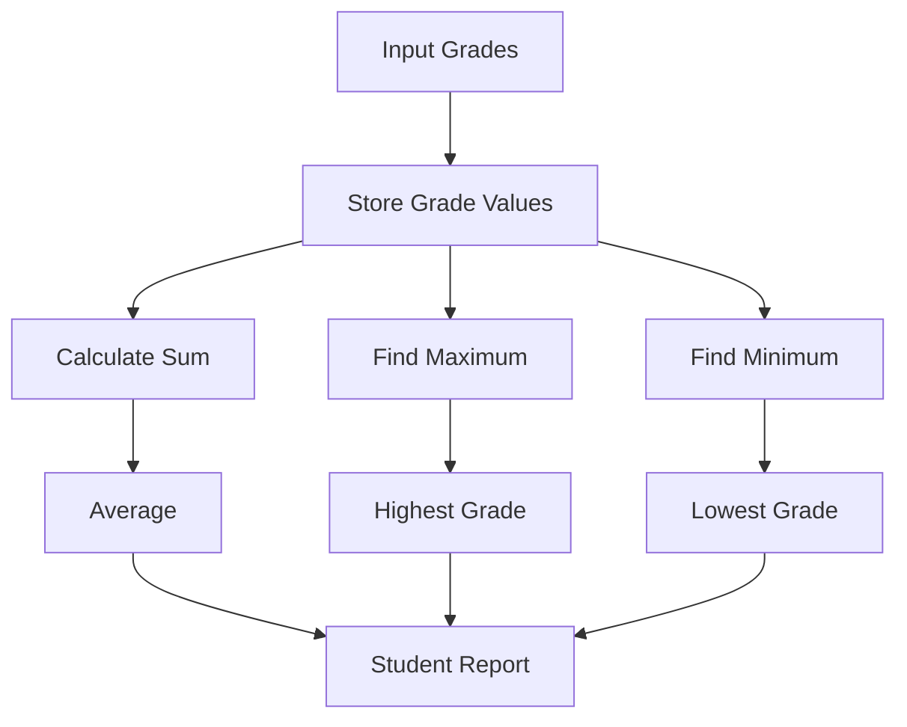

# ☕ CodeAlpha Java Tasks

> Java programming tasks completed as part of the **CodeAlpha Internship Program**, demonstrating object-oriented programming, Swing/AWT GUI development, input handling, and student grade calculations.

## 📌 Overview

This repository contains Java work completed during the CodeAlpha internship.

The current task is a **Student Grade Manager** desktop application built with Java Swing/AWT.

The application provides an interactive interface for entering student information and grades, calculating academic statistics, and generating a student report.

---

# ✨ Features

- 👨‍🎓 Student information management
- 📝 Grade input
- 📊 Average grade calculation
- ⬆️ Highest grade calculation
- ⬇️ Lowest grade calculation
- 📄 Report generation
- 🖥️ Java Swing/AWT graphical interface
- ⚡ Interactive buttons and event handling
- 📋 Display of calculated results

---

# 🏗️ Application Architecture



---

# 🔄 Application Workflow



---

# 🧮 Grade Calculation

The application calculates three primary statistics.

### Average

```text
Average = Sum of Grades / Number of Grades
```

### Highest

```text
Highest = Maximum value in grade collection
```

### Lowest

```text
Lowest = Minimum value in grade collection
```

Conceptually:



---

# 🖥️ GUI Architecture

The application uses Java's desktop GUI ecosystem.

```text
Java Application
       │
       ▼
  Swing / AWT
       │
       ├── Labels
       ├── Text Fields
       ├── Buttons
       ├── Panels
       └── Output Components
              │
              ▼
        Event Handlers
              │
              ▼
        Grade Processing
              │
              ▼
          Report Output
```

---

# 🧩 Main Responsibilities

| Area | Responsibility |
|---|---|
| GUI | Provides the desktop interface |
| Input handling | Collects student and grade information |
| Grade processing | Performs calculations |
| Statistics | Finds average, highest and lowest values |
| Report generation | Produces a readable student result |
| Event handling | Connects user actions to application logic |

---

# 📁 Project Structure

```text
CodeAlpha-Java-Tasks/
│
├── java
│   └── Student Grade Manager source
│
└── README.md
```

---

# ⚙️ Requirements

```text
Java JDK 8+
```

The project uses standard Java desktop libraries, so no external dependency installation is required for the core application.

---

# 🚀 Getting Started

## 1. Clone the repository

```bash
git clone https://github.com/Naveenbabu45/CodeAlpha-Java-Tasks.git
cd CodeAlpha-Java-Tasks
```

## 2. Navigate to the Java task

Open the `java` directory and locate the Student Grade Manager source file.

## 3. Compile

```bash
javac <JavaFileName>.java
```

## 4. Run

```bash
java <ClassName>
```

The Swing/AWT interface should then open as a desktop window.

---

# 🎯 Example Workflow

```text
Start
  │
  ▼
Enter Student Details
  │
  ▼
Enter Grades
  │
  ▼
Process Data
  │
  ├── Average
  ├── Highest
  └── Lowest
  │
  ▼
Generate Report
  │
  ▼
Display Result
```

---

# 📚 Java Concepts Demonstrated

- Java syntax and fundamentals
- Classes and objects
- Methods
- Variables and data types
- Arrays / collections used for grade processing
- Conditional logic
- Iteration
- Event-driven programming
- Swing GUI development
- AWT components
- User input handling
- Basic data processing

---

# 🧠 Learning Outcomes

This task provided practical experience with:

### ☕ Core Java

- Writing structured Java programs
- Organizing logic into methods
- Processing collections of values

### 🖥️ GUI Development

- Building desktop interfaces with Swing
- Working with AWT components
- Handling button actions and user events

### 📊 Data Processing

- Calculating aggregate values
- Finding minimum and maximum values
- Presenting processed data as a report

### 🧩 Problem Solving

- Converting a real-world grade-management requirement into application logic
- Connecting user input with calculations
- Presenting results in a usable interface

---

# 🛣️ Future Enhancements

- [ ] Add persistent student records
- [ ] Support multiple students
- [ ] Add subject-wise grades
- [ ] Add percentage calculation
- [ ] Add letter-grade classification
- [ ] Add GPA calculation
- [ ] Export reports to PDF
- [ ] Export results to CSV
- [ ] Add database integration
- [ ] Add input validation and error messages
- [ ] Modernize the Swing interface
- [ ] Add search and filtering

---

# 🧪 Testing Scenarios

| Scenario | Expected Behavior |
|---|---|
| Valid student details | Accept and process input |
| Multiple valid grades | Calculate statistics |
| Highest grade present | Display maximum |
| Lowest grade present | Display minimum |
| Grade collection processed | Display average |
| Report action | Generate student report |
| Invalid input | Handle appropriately according to the application flow |

---

# 🎯 Internship Context

This project is part of the **CodeAlpha Internship** task collection and demonstrates practical Java development through a desktop-based Student Grade Manager.

It combines:

```text
Java Fundamentals
       +
Swing / AWT
       +
Event Handling
       +
Data Processing
       =
Interactive Desktop Application
```

---

# 📌 Project Status

```text
Status: Completed
Program: CodeAlpha Internship
Category: Java Development
Application: Student Grade Manager
```

---

# 👨‍💻 Author

**Naveen Babu**

B.Tech Computer Science & Engineering Student

- GitHub: https://github.com/Naveenbabu45
- LinkedIn: https://www.linkedin.com/in/kommmavarupanaveenbabu
- Portfolio: https://naveen-portfolio-swart-rho.vercel.app/

---

# 🔗 Repository

https://github.com/Naveenbabu45/CodeAlpha-Java-Tasks
